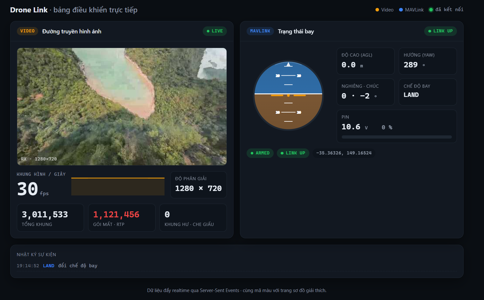

# drone-video-link

A ground-station link prototype for a drone camera payload: **low-latency H.264 video downlink over RTP/UDP** and a **MAVLink telemetry & control gateway**, built and profiled on Embedded Linux.

Developed against the software stack used on Jetson Xavier/Orin NX companion computers, but runnable entirely on a laptop — video source is simulated with `videotestsrc`, the flight controller with ArduPilot SITL. No drone required.



> The [live dashboard](dashboard/) streams both channels to the browser over Server-Sent Events. Above is the synthetic walk-through (`python dashboard/server.py --synthetic`); the same page renders the real receiver and SITL telemetry when they are running.

---

## System

```
        ┌──────────────────────────────┐          ┌──────────────────────────┐
        │  Companion computer          │          │  Ground station          │
        │  (Jetson Orin NX)            │          │                          │
        │                              │          │                          │
Camera ─┼─► GStreamer ─► H.264 ─► RTP ─┼─ UDP ────┼─► C++ receiver ─► display │
        │                              │ Ethernet │                          │
   FC ──┼─► MAVLink router ────────────┼─ UDP ────┼─► Python gateway ─► logs  │
(Pixhawk)                              │          │                          │
        └──────────────────────────────┘          └──────────────────────────┘
```

Both components are simulated on one host. See [docs/00-OVERVIEW.md](docs/00-OVERVIEW.md) for
what is real and what is simulated.

## Components

| Directory | What it is | Language |
|---|---|---|
| [`video/`](video/) | RTP/H.264 sender + C++ `appsink` receiver, latency measurement, packet-loss experiments | C++17, CMake, Shell |
| [`mavlink/`](mavlink/) | MAVLink gateway: heartbeat watchdog, arm/takeoff/land, telemetry logging, MQTT bridge | Python 3 |

## Results

| Metric | Value |
|---|---|
| Pipeline latency, stock defaults | **2288 ms** |
| Pipeline latency, tuned | **7.8 ms** — and it is not B-frames; `x264enc` ships with `bframes=0` |
| Where the 2 s went | rate-control lookahead (40 frames, costing 40 frames) + one frame per encoder thread |
| Behaviour under 2% packet loss | every picture is delivered; the pixels are wrong for up to a second |
| How long one lost packet corrupts the picture | until the next keyframe — 29 of 29 damage episodes across four test patterns, and 36 of 36 when the packet is chosen rather than random |
| Losing a keyframe's slice vs a P picture's | **5.8× the pixel error**, and it is decided in the picture the packet was lost in, not accumulated after it |
| What the application sees at 20% loss | 474 packets gone, 148/150 pictures delivered, **zero decoder flags** |
| Cost of `rtpjitterbuffer latency=0` | 67 of 300 pictures under ±5 ms jitter with **no packet loss at all** |

Every number here was measured on this machine, and the script that produces it is in the
repo. Full method: [`video/results/latency.md`](video/results/latency.md) and
[`video/results/packet-loss.md`](video/results/packet-loss.md).

Demo: 30 seconds of the received video, impaired half way through and recovering —
[`docs/assets/demo.mp4`](docs/assets/demo.mp4).

On the MAVLink side: a heartbeat watchdog that declares `LINK LOST` within one 3-second
failsafe interval (unit-tested against an injected clock, 7/7), telemetry parsed and scaled
to SI then logged to CSV/JSONL, and arm/takeoff/land that verify each `COMMAND_ACK` and honour
ArduPilot's command ordering. Validated end to end against a real **ArduPilot SITL** build —
`takeoff 10` arms and climbs to 10 m repeatably — which caught two bugs a mock had hidden
(telemetry stream requests, and the pre-arm race). Details in
[`mavlink/README.md`](mavlink/README.md).

## Documentation

Written in Vietnamese — the engineering notebook for this project.

| Doc | Purpose |
|---|---|
| [00-OVERVIEW](docs/00-OVERVIEW.md) | The real problem, and what this project simulates |
| [01-PLAN](docs/01-PLAN.md) | Two-day execution plan with checkpoints and fallbacks |
| [02-STATE](docs/02-STATE.md) | Live progress tracker |
| [03-ARCHITECTURE](docs/03-ARCHITECTURE.md) | Directory layout and data flow |
| [04-CONCEPTS](docs/04-CONCEPTS.md) | Every concept used here, explained from scratch |
| [05-DECISIONS](docs/05-DECISIONS.md) | Why each technical choice was made |
| [06-INTERVIEW-QA](docs/06-INTERVIEW-QA.md) | Questions this project should let me answer |

## Environment

Ubuntu 22.04 (WSL2). Both endpoints run inside the same distro over `127.0.0.1`.

```bash
sudo apt install -y \
  libgstreamer1.0-dev libgstreamer-plugins-base1.0-dev \
  gstreamer1.0-tools gstreamer1.0-plugins-base gstreamer1.0-plugins-good \
  gstreamer1.0-plugins-bad gstreamer1.0-plugins-ugly gstreamer1.0-libav \
  cmake build-essential pkg-config ffmpeg iproute2
```
