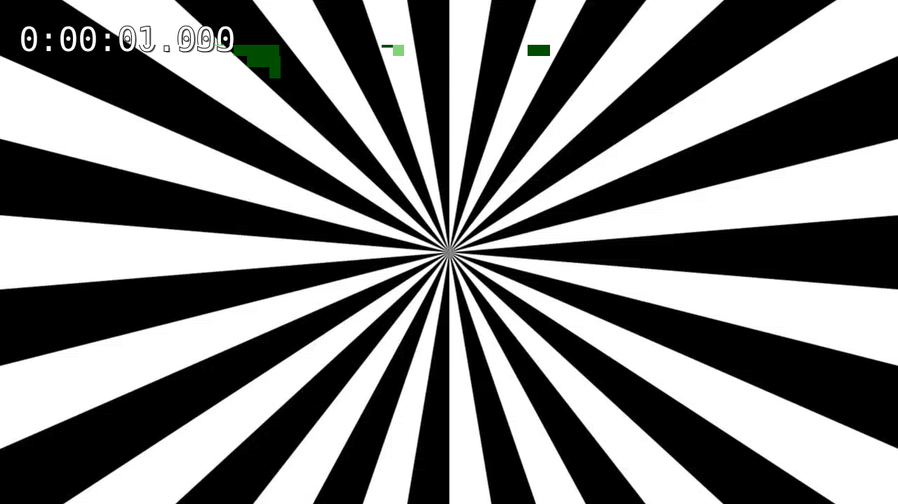

# video/ — Low-latency H.264 downlink over RTP/UDP

A GStreamer sender, a **C++ receiver built on the GStreamer C API** (`appsink`), and two
experiments: where the latency actually goes, and what a single lost UDP packet does to the
picture.

Everything below was measured on this machine. Nothing is quoted from a tutorial.

**Host:** WSL2 Ubuntu 22.04, 16 logical cores, GStreamer 1.20.3, x86-64 software encoding.
**Stream:** 1280×720 @ 30 fps, 2 Mbit/s, `key-int-max=30` (one keyframe per second).

## The two results worth your time

**Pipeline latency: 2288 ms → 7.8 ms.** Almost all of it was one element. The usual
explanation — B-frames — is wrong for `x264enc`, which ships with `bframes=0`. The delay is
rate-control lookahead (40 frames, and it costs exactly 40 frames) plus frame-parallel
threading (about one frame per worker thread). [`results/latency.md`](results/latency.md)

**One lost packet corrupts the picture for a whole second, and the application cannot tell.**
Twenty-nine damage episodes across four test patterns, twenty-nine ending exactly at the next
keyframe. At 20% packet loss the decoder raised no flag on any picture. Link health has to be
counted at the RTP layer, because nothing downstream of it knows.
[`results/packet-loss.md`](results/packet-loss.md)

## Pipeline

```
sender.sh                                                    (companion computer)
  videotestsrc ─► timeoverlay ─► videoconvert ─► x264enc ─► rtph264pay ─► udpsink
                                                                              │
                                                                        UDP :5000
                                                                              │
src/receiver.cpp                                               (ground station)
  appsink ◄─ videoconvert ◄─ avdec_h264 ◄─ rtph264depay ◄─ rtpjitterbuffer ◄─ udpsrc
```

Two details that the diagram hides and that the experiments depend on:

- `tune=zerolatency` switches x264 to **sliced threads**, so each picture is cut into **11
  independently-decodable horizontal bands**, each its own NAL, each at least one RTP packet.
  A lost packet destroys a band, not a frame. That is why the corrupted screenshot below
  shows stripes rather than a green screen.
- `rtph264pay config-interval=1` re-sends SPS/PPS every second. Without it, a receiver that
  starts after the sender never learns the stream parameters and displays nothing, forever.

## Build

```bash
cmake -B build && cmake --build build
```

Needs `libgstreamer1.0-dev`, `libgstreamer-plugins-base1.0-dev`, and the `good`/`bad`/`ugly`
plugin sets (`x264enc` lives in `ugly`, `rtpjitterbuffer` in `good`).

## Run

```bash
./scripts/sender.sh                    # terminal 1
./build/receiver --port 5000           # terminal 2
```

`./scripts/receiver.sh` is the same pipeline as a `gst-launch` one-liner, with a window. It
exists because it was written first: the C++ receiver is a port of a pipeline that was made
to work in the shell before any C++ was written.

Receiver flags, all of which name a real decision:

| flag | default | what it changes |
|---|---|---|
| `--jitter-latency MS` | 0 | how long the jitter buffer holds a packet for its late siblings |
| `--sync` | off | wait for each buffer's presentation timestamp before handing it over |
| `--wait-for-keyframe` | off | after a loss, show *nothing* until the next IDR, instead of a damaged picture |
| `--no-lost-events` | — | stop the jitter buffer announcing gaps downstream |
| `--verbose` | off | one line per frame |

## Measure latency

```bash
./scripts/measure-latency.sh 150
```

Runs `GST_TRACERS="latency(flags=pipeline+element)"` over ten encoder/buffer configurations
and prints the medians. Medians, not means: when the source stops, the encoder drains its
backlog quickly and those last frames drag the mean 450 ms below steady state.

| # | Configuration | Pipeline latency | of which `x264enc` | of which jitter buffer |
|---|---|---|---|---|
| 1 | stock defaults, `rtpjitterbuffer latency=200`, `sync=true` | **2288 ms** | 2067 ms | 218 ms |
| 2 | `+ tune=zerolatency speed-preset=ultrafast` | **223 ms** | 4.2 ms | 216 ms |
| 3 | `+ rtpjitterbuffer latency=0` | **23 ms** | 4.2 ms | 15.5 ms |
| 4 | `+ sink sync=false` | **7.8 ms** | 4.1 ms | 0.8 ms |

Row 3 → 4 is the interesting one. Turning off clock sync at the **sink** dropped the **jitter
buffer's** contribution from 15.5 ms to 0.8 ms. The sink was blocking, upstream elements
backed up behind it, and the buffers were queueing in the jitter buffer. *The element that
showed the symptom was not the element with the problem.*

Full derivation, including the isolation runs that pin the encoder delay on lookahead and
thread count rather than B-frames: [`results/latency.md`](results/latency.md).

## Simulate a lossy link

```bash
sudo ./scripts/netem.sh on               # loss 2%
sudo ./scripts/netem.sh on loss 5%       # anything netem accepts
sudo ./scripts/netem.sh status           # the kernel's own drop counter
sudo ./scripts/netem.sh off
```

Under WSL, `sudo` is `wsl -d Ubuntu-22.04 -u root bash scripts/netem.sh on`.

The default impairment is loss **without** added delay, which is not the obvious choice. Add
`delay 20ms 5ms` and the receiver's `latency=0` jitter buffer throws away three quarters of a
*perfectly delivered* stream for arriving out of order — the picture freezes instead of
breaking. Both failures are real; the demo is about the second one.

## What packet loss does

Reproduce the whole thing:

```bash
sudo ./scripts/packet-loss.sh                       # the delivery tables
PATTERN=pinwheel ./scripts/make-stream.sh /tmp/s.h264 600
./scripts/gop-stats.sh /tmp/s.h264 0.0021           # GOP structure + prediction
./scripts/frame-diff.sh /tmp/clean /tmp/lossy 30    # the pixel experiment
sudo ./scripts/pattern-damage.sh                    # does the test pattern matter?
./scripts/idr-vs-p.sh zone-plate "kx2=20 ky2=20 kt2=1"   # keyframe loss vs P loss
```

| | |
|---|---|
|  |  |
| **Picture 29, as sent.** | **Picture 29, as received.** One packet of this GOP's keyframe was lost 29 pictures earlier. Two slices never arrived, and every picture since has copied the hole forward. |



**Picture 30, the next keyframe.** Coded without reference to anything, so it owes the
previous picture nothing, and the bands are gone.

Four findings, each with the measurement behind it in
[`results/packet-loss.md`](results/packet-loss.md):

**The error does not decay — it ends.** Mean absolute pixel difference against the reference
sits flat at 22.6 for the whole GOP, then reads 0.336 at the IDR and 0.000 at the next clean
one. A P picture that copies a wrong block copies it *exactly*. Across four test patterns,
29 of 29 damage episodes ended on a keyframe boundary, never one picture early or late — and
with netem removed from the question entirely, deleting each of a picture's 11 slices in turn,
36 of 36.

**Losing a keyframe's slice is 5.8× worse than losing a P slice, and the damage is decided at
impact.** `idr-vs-p.sh` deletes exactly one slice NAL and decodes — no randomness, every slice
tried in turn. The keyframe victim's episode lasts twice as long, but that is only because it
sits a full GOP from the next keyframe; the 5.8× is already there in the *first* damaged
picture, before any error has propagated. Concealing an intra-coded band is what is hard.

**The decoder conceals in silence.** At 20% loss, 474 packets never arrived, the application
received 148 of 150 pictures, and `GST_BUFFER_FLAG_DISCONT` was 0 on every one of them.
`CORRUPTED` only trips once the video is unusable anyway. A "video healthy" indicator built on
frame counts or decoder flags reads green while the operator stares at a wrecked picture.

**`latency=0` does not tolerate a network, it tolerates a wire.** Under 20 ± 5 ms of jitter
and *zero* packet loss, the receiver decodes 67 of 300 pictures; the kernel drops nothing and
the jitter buffer discards 3495 packets for arriving late. At `latency=200` it decodes 270–300.
That is the invoice for the 200 ms saved in row 3 of the latency table, and it is why the two
experiments belong in the same README.

## Demo

[`../docs/assets/demo.mp4`](../docs/assets/demo.mp4) — 31 s of the *received, decoded* video,
not a screen capture: 10 s clean, 10 s under `loss 2%` (88 packets dropped), 10 s recovering.
Regenerate it headlessly, no display needed:

```bash
sudo ./scripts/record-demo.sh
```

Or watch it live, two terminals side by side plus one to drive the impairment on a schedule:

```bash
# terminal 1                                                       # terminal 2
PATTERN=zone-plate SRC_EXTRA="kx2=20 ky2=20 kt2=1" \
  ./scripts/sender.sh                                              ./scripts/receiver.sh

# terminal 3 — 15 s clean, 15 s at 2% loss, 15 s recovering
sudo ./scripts/demo.sh
```

The pattern is not decoration. Run this with the default `smpte` bars and the link looks
perfectly healthy while it is losing packets: at 0.15% loss every pattern tested has 110–155
of its 600 pictures altered, but the median error ranges from 0.01 of 255 on `pinwheel` to
4.22 on the animated zone plate. **The picture decides what you can see, not what happened.**
The first cut of this clip used `pinwheel` — which, measured, does not move at all — and
showed a link in perfect health.

## Scripts

| script | what it does | root? |
|---|---|---|
| `common.sh` | one copy of the network and encoder settings, sourced by the rest | |
| `sender.sh` | camera → H.264 → RTP → UDP; `PROFILE`, `PATTERN`, `NUM_BUFFERS`, `STREAM` | |
| `receiver.sh` | the reference receiver, as a `gst-launch` pipeline with a window | |
| `measure-latency.sh` | ten configurations under `GST_TRACERS`, medians and trend | |
| `netem.sh` | impair / repair the loopback interface | yes |
| `demo.sh` | drives the netem timeline for a live demo | yes |
| `record-demo.sh` | records the received video through that timeline, headless | yes |
| `packet-loss.sh` | the two delivery tables, both instruments side by side | yes |
| `make-stream.sh` | encode once to a file, so two runs share one bitstream | |
| `gop-stats.sh` | walks the Annex-B NALs: GOP structure, packet model, Monte Carlo | |
| `capture-frames.sh` | dump decoded pictures as PNG and raw RGB | |
| `frame-diff.sh` | mean absolute pixel difference per picture; damage episodes | |
| `pattern-damage.sh` | does the test pattern decide whether loss is visible? | yes |
| `idr-vs-p.sh` | deletes one slice NAL and decodes: keyframe loss vs P loss | |

`make-stream.sh` exists because **x264enc is not bit-reproducible**: encoding the same
deterministic `videotestsrc` input twice gives two different files. A clean run and a lossy
run would have had no common reference, and the pixel experiment would have produced
confident nonsense. Freezing the bitstream first makes the control read what a control must
read — 600 of 600 pictures bit-exact.

## Mapping to Jetson Orin NX

The RTP layer is where all of this lives, and none of it changes: `rtph264pay`, `udpsink`,
`rtpjitterbuffer`, `rtph264depay`, the jitter-versus-latency trade, and `receiver.cpp` itself.

| Here (x86) | Jetson |
|---|---|
| `videotestsrc` | `nvarguscamerasrc` (CSI) / `v4l2src` (USB) |
| `videoconvert` | `nvvidconv` (NVMM buffers, no CPU copy) |
| `x264enc` | `nvv4l2h264enc` (NVENC hardware encoder) |
| `avdec_h264` | `nvv4l2decoder` |

The encoder swap changes two things this README leans on. **These come from the documented
property set of `nvv4l2h264enc`, not from a board — I do not have one.**

- The 2 s of software-encoder delay does not exist on NVENC, but neither knob transfers:
  there is no `rc-lookahead` and no frame threads. `iframeinterval` replaces `key-int-max`,
  and `insert-sps-pps=true` plays the role of `config-interval=1`.
- There is no `sliced-threads`. A picture is one slice unless `slice-header-spacing` is set,
  so a lost packet damages the **whole picture** rather than one of eleven bands.

The keyframe/P size ratio — 15.0× here — is a property of the *content*, not of H.264: the
same encoder gives 2.8× on still colour bars and 3.2× on a bouncing ball. It sets the
packet-weighted cost of one lost packet, so it would have to be measured again on the real
camera.

## Known limitations

- Both endpoints run on loopback. No NIC, no MTU discovery, no congestion, no real radio.
- `tc netem`'s `loss X%` drops packets **independently**. A radio loses them in bursts, and
  twenty consecutive packets do far more damage than twenty scattered ones. `loss gemodel`
  would model that; this repo has not measured it.
- Latency reported is **pipeline latency** (`GST_TRACERS`), not glass-to-glass: it excludes
  camera exposure, display buffering and the network.
- Software encoding only. NVENC latency is not measured.
- No RTCP, so no receiver reports and no `request-keyframe` recovery after a loss.
